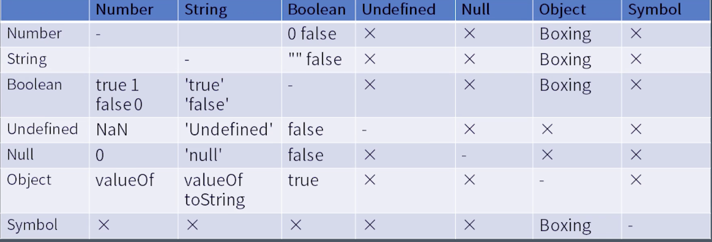
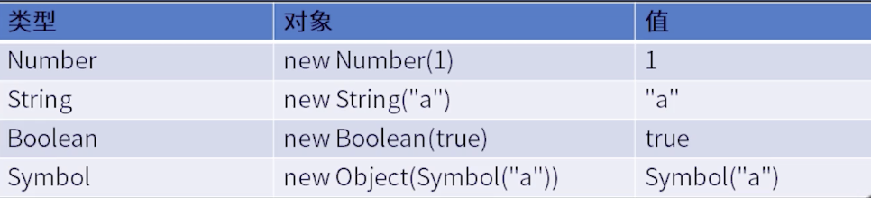

# 学习笔记
## 运算符与表达式
### 类型转换
js一般一共六种基本数据类型：string、number、Boolean、null、undefined、symbol

object、array、function、data、RegExp
#### 表达式：a + b = c
`a + b`一定要作用于字符串和两个数字之间，一旦a和b属于别的类型，就会发生类型转换
#### 表达式中发生类型转换的例子
- a + b
- "false" == false
- a[0] = 1
#### JavaScript7中基本类型之间如何进行转换


#### 装箱转换
object有类的概念，对每个基础类型object都提供了一个包装的类（除了undefined和null）

Number既可以使用new去调用也可以直接调用，直接调用会返回一个值，使用new去调用返回一个object，这个时候object和值之间存在一个装箱关系
## javaScript语句
### 简单语句和复合语句
- block
blockstatement
```js
{

}
```
- lteration
```js
  while
  do-while
  for( ; ; )
  for( in )
  for( of )
```
- try
```js
try {

}catch {

}
```
### 声明
#### function function* async function async function var
特点是作用范围只有function body，且没有先后关系，函数声明会被提升

var的声明相当于出现在函数的头部，但是如果我们写`var a = 1`，变量被声明为了函数级的局部变量，但是赋值没有发生。

#### class const let
声明不会被提升。
#### 预处理
预处理指在一段代码执行前js会对代码执行预先处理，预处理会提前找到所以var声明的变量，把这个变量升级到函数的作用级别。

const并不是没有预处理机制，所有声明都有预处理机制，但变量在const声明前使用会报错，且报错会被catch捕获。
#### 作用域
const和let会将变量绑定到块级作用域中。


## js的任务和微任务
在JavaScript中，任务被分为两种，一种宏任务（MacroTask）也叫Task，一种叫微任务（MicroTask）。
### 事件队列
javascript是单线程，同一时间只能做同一件事，所有同步任务都在主线程上执行，形成一个执行栈，主线程之外还有一个任务队列，当异步任务有了运行结果，系统就会读取任务队列看里面对应的异步任务，结束等待状态，将任务放到执行栈开始执行。
### 宏任务（task）
浏览器为了能够使得js内部task与DOM任务能够有序的执行，会在一个task结束以后在下一个task执行开始前，对页面进行重新渲染。

script全部代码、setTimeOut、setInterval、setImmediate、I/O、UI Rendering。
### 微任务
微任务通常来说就是需要在当前task执行结束后立即执行的任务，比如对一系列动作的反馈，或者是需要异步执行的任务而又不需要分配一个新的task，这样做可以减小性能的开销，执行栈中没有要执行的代码而且每个宏任务执行完，就会开始执行微任务

Process.nextTick（Node独有）、Promise、Object.observe(废弃)、MutationObserver（具体使用方式查看这里）
### 总结
- 宏任务按顺序执行，且浏览器执行完每个宏任务后都会渲染页面，
- 微任务也是按顺序执行，执行场景：
  - 每一个回调之后且js执行栈为空
  - 每个宏任务结束后